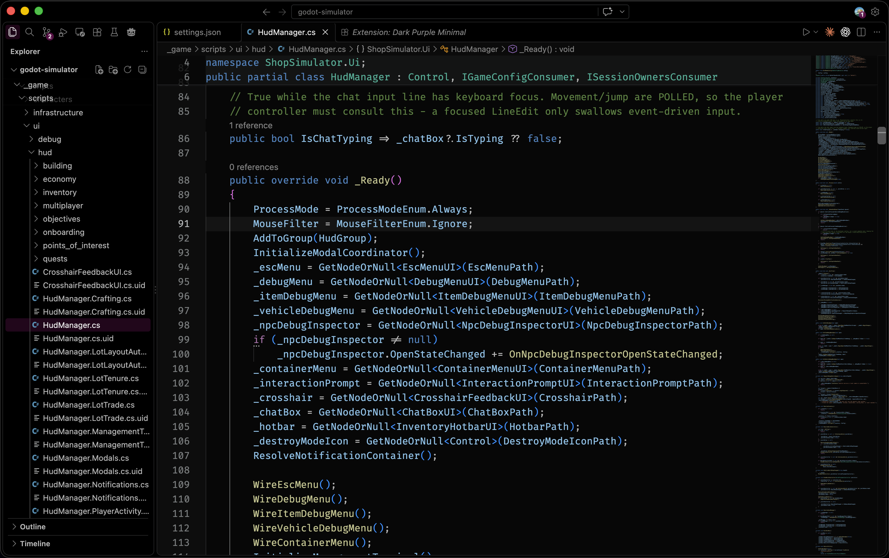

# Minimal Black & Purple Theme

A minimal black theme with purple accents and softer Dark Modern syntax colors for Visual Studio Code.



## Features

- Black and near-black backgrounds across the editor, tabs, sidebar, panels, and terminal.
- Deep purple accents for buttons, badges, selections, and focus indicators.
- Familiar Dark Modern syntax and semantic highlighting, slightly dimmed for softer code text.
- A subtle current-line highlight.

## Install

Search for **Minimal Black & Purple Theme** in the VS Code Extensions view and click **Install**. Then open **Preferences: Color Theme** from the Command Palette and select **Minimal Black & Purple Theme**.

## Optional layout and font settings

To match the minimal layout in the preview, add these preferences to your VS Code user settings. Install [Fira Code](https://github.com/tonsky/FiraCode) if you want the same font and ligatures.

```json
{
  "workbench.startupEditor": "none",
  "workbench.activityBar.location": "top",
  "editor.fontSize": 16,
  "editor.fontFamily": "Fira Code",
  "editor.fontLigatures": true,
  "workbench.statusBar.visible": false,
  "workbench.layoutControl.enabled": false
}
```

These preferences are optional and are configured separately from the theme.

## Customization

Use `workbench.colorCustomizations` to adjust individual interface colors. Existing user color overrides take precedence over the theme. Syntax colors can be adjusted with `editor.tokenColorCustomizations` and `editor.semanticTokenColorCustomizations`.

## Feedback

Report problems or suggest improvements on [GitHub](https://github.com/ape1121/dark-2026-minimal-purple/issues).

## Credits and license

Interface colors are based on Microsoft's Dark 2026 theme. Syntax and semantic highlighting are derived from Dark Modern, with foreground RGB channels reduced by 7%. Distributed under the [MIT license](LICENSE).
